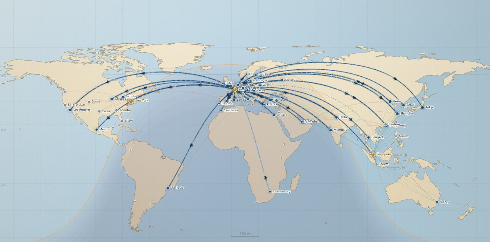
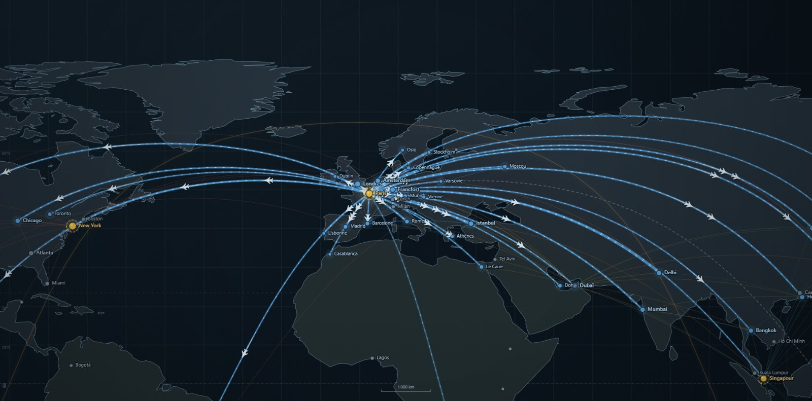

# Skyline — simulateur de compagnie aérienne

Jeu de gestion 2D en temps réel : vous dirigez une compagnie aérienne mondiale, de deux
avions à la première place du classement. Tout tient dans une page web, sans dépendance
ni installation.



## Jouer

Téléchargez le dépôt et **double-cliquez `index.html`**. C'est tout : pas de serveur,
pas de `npm install`, aucune connexion réseau. Le jeu tourne dans n'importe quel
navigateur récent et sauvegarde la partie dans le navigateur.

## Le principe

Vous dirigez une compagnie aérienne mondiale. 150 M€ en caisse, deux A320, et une carte
du monde avec 71 vraies villes. Objectif final : **1 milliard € de valeur d'entreprise**
et la **première place mondiale** en trafic. Ensuite, la partie continue en mode libre.

## Prise en main

1. **Cliquez une ville** sur la carte → achetez un **créneau** (il en faut un par avion et par escale).
2. **« Ouvrir une ligne »** puis cliquez la ville de destination.
3. Achetez un avion dans **Constructeurs** et affectez-le à la ligne.
4. Réglez le **tarif** et la **fréquence** dans la fiche de ligne.
5. Les comptes tombent en fin de mois.

Raccourcis : `Espace` pause · `1` `2` `3` `4` vitesses ×1 ×2 ×4 ×8 · molette pour zoomer ·
glisser pour déplacer la carte. La **flèche** en haut du volet revient à la vue précédente
(le panneau Réseau après avoir ouvert une ligne, par exemple) ; `Échap` fait de même, puis
referme le volet.

## Les trois leviers qui comptent

| Levier | Effet mesuré en jeu |
|---|---|
| **Tarif** | À 75 % du prix de référence le remplissage passe de 40 à 53 % ; à 145 % il tombe à 27 % |
| **Fréquence** | Passer de 14 à 8 vols/jour sur Paris–Londres fait monter le remplissage de 40 à 62 % et le résultat de 28 à 45 k€/jour |
| **Choix de l'appareil** | Un A220 bien calibré rapporte 67 k€/jour sur Paris–Londres, un A320 surdimensionné seulement 25 k€ |
| **Nombre d'appareils** | Rien ne limite le nombre d'avions sur une même ligne : chacun ajoute ses rotations. Il faut un créneau libre à chaque escale, par appareil |

Le bouton **Conseillée** de la fiche de ligne calcule la fréquence qui maximise le résultat,
compte tenu de la demande, de la concurrence et de tous les coûts.

## Ce que simule le jeu

| Système | Détail |
|---|---|
| Demande | Par paire de villes : population, indices affaires/tourisme, distance, proximité géographique, saison |
| Concurrence | 5 compagnies IA qui ouvrent des lignes, montent en fréquence et cassent les prix sur vos meilleures routes — plus une concurrence de fond sur chaque liaison |
| Parts de marché | Réparties selon fréquence, tarif et réputation de chaque opérateur |
| Créneaux | Ressource rare : les aéroports saturent, les concurrents les prennent aussi |
| Hubs | Jusqu'à 4. Redevances réduites et **correspondances** : vos lignes se nourrissent entre elles |
| Cabines | Éco / affaires / première — 3× et 6× le tarif, mais 2,4× et 4,6× la place |
| Fret | En soute sur les avions de ligne, ou avions tout-cargo (part de marché fondée sur le tonnage offert) |
| Usure | Chaque heure de vol use l'appareil : annulations au-delà de 55 %, immobilisation à 100 % |
| Finances | Emprunts à 6,8 % sur 60 mois, dépréciation, faillite après 45 jours de découvert |
| Événements | Rares : crise du kérosène, récession, grève régionale, tempête, destination virale, salon aéronautique |

## Lire la carte d'un coup d'œil

Chaque ligne prend la couleur de son état, réévalué chaque jour :

| Couleur | État | Ce qu'il faut faire |
|---|---|---|
| Bleu foncé | saine | rien |
| **Rouge** (avec halo pulsé) | **saturée** — remplissage ≥ 95 %, ou ≥ 88 % avec des passagers refusés | ajouter un appareil, monter en fréquence ou augmenter le tarif |
| Violet | déficitaire | revoir le tarif, l'appareil ou fermer |
| Bleu pâle | trop vide — moins de 50 % de remplissage | baisser la fréquence ou le tarif, ou mettre un appareil plus petit |
| Gris pointillé | sans avion, ou appareils cloués au sol | affecter un appareil |

Le panneau **Réseau** affiche les lignes sous leur **nom complet** (« Paris ↔ Londres »),
avec le code IATA et la distance en dessous, une étiquette d'état et une alerte en tête
quand des lignes saturent. Survoler une ligne du tableau la met en avant sur la carte.

## Améliorations et programmes

Chaque appareil accepte six **rétrofits**, dont le prix suit sa taille :

| Rétrofit | Effet |
|---|---|
| Dispositifs de bout d'aile | −4 % de carburant |
| Rétrofit moteurs | −3,5 % de carburant, +6 % de maintenance |
| Maintenance prédictive | **−30 % d'usure** |
| Allègement cabine | −1,8 % de carburant, −5 % d'usure |
| Rénovation de cabine | +2,6 de réputation, +5,5 % de tolérance tarifaire |
| Connectivité à bord | +1,5 de réputation, +3 % de tolérance tarifaire |

Et quatre **programmes de compagnie**, achetés une fois, valables pour toute la flotte
présente et à venir :

- **Atelier de maintenance intégré** — révisions 25 % moins chères et trois jours plus courtes.
- **Planification automatique des révisions** — tout appareil qui dépasse le seuil d'usure part
  de lui-même à l'atelier, les plus usés d'abord, dans la limite de la capacité des hangars
  (un sixième de la flotte à la fois), et retrouve sa ligne au retour.
- **École de formation interne** — 15 % sur les salaires des équipages et budget formation
  supprimé, chaque mois, sur toute la flotte.
- **Couverture carburant** — les crises pétrolières ne frappent plus qu'à moitié.

## Comptabilité

Chaque euro dépensé est ventilé dans le panneau **Statistiques**, en quatre familles :

- **Exploitation des vols** — carburant, heures de vol des équipages, maintenance en ligne,
  redevances de navigation aérienne, redevances d'atterrissage, assistance en escale.
- **Service aux passagers** — restauration et service à bord, distribution et commissions
  (un pourcentage des recettes billets).
- **Charges de flotte, dites passives** — salaires des équipages, maintenance programmée,
  assurance, stationnement et hangar, formation, informatique, grandes visites.
  **Elles courent que l'avion vole ou non** : un appareil laissé au sol perd de l'argent
  tous les jours, et ces charges sont imputées à la ligne sur laquelle il est affecté.
- **Structure et financement** — siège, marketing, redevances de créneaux, échéances d'emprunt.

Le panneau donne aussi les ratios du métier : recette et coût au siège-kilomètre, recette
unitaire passager, coefficient de remplissage, recette et coût moyens par vol, utilisation
quotidienne de la flotte, et la part respective des coûts variables et passifs.

## Statistiques d'escale

La fiche de chaque aéroport affiche vos mouvements, passagers, fret, correspondances et
heures de vol quotidiennes, le résultat qui y est attribué, les redevances versées,
l'occupation détaillée des créneaux (les vôtres utilisés, les vôtres libres, ceux des
concurrents, ceux encore à vendre), votre part du marché local et les compagnies présentes.

## Affichage

L'engrenage en bas à droite de la carte ouvre les réglages : **mode sombre**,
**cycle jour / nuit**, lignes des concurrents, traînées de condensation, halos de trafic,
noms de villes, grain du papier. Les choix sont conservés d'une partie à l'autre.

Le mode sombre habille aussi bien l'interface que la carte, qui passe d'un atlas de jour
sur papier clair à un atlas de nuit sur fond encre.



## Fichiers

```
index.html          interface et styles
js/data-land.js     trait de côte mondial (Natural Earth 1:50m, 247 anneaux simplifiés)
js/data-world.js    les 71 villes desservies
js/data-game.js     équilibrage, avions, rétrofits, programmes, concurrents, événements, plan comptable
js/engine.js        moteur de simulation (demande, exploitation, IA, finances)
js/render.js        rendu de la carte sur canvas
js/ui.js            panneaux et fiches
js/ui-stats.js      panneau Statistiques et fiche statistique d'escale
js/main.js          boucle de jeu, entrées, sauvegarde
```

La partie est sauvegardée dans le `localStorage` du navigateur (bouton **Sauvegarder**,
plus une sauvegarde automatique toutes les 90 secondes).

## Réglages

Toutes les constantes d'équilibrage sont regroupées dans `BAL`, en haut de
`js/data-game.js` : durée d'une journée, tarifs de référence, échelle de la demande,
coûts variables, charges passives par appareil, seuils d'usure, conditions de victoire.

## Sous le capot

Aucune bibliothèque, aucun outil de compilation : du HTML, du CSS et du JavaScript
lisibles directement. La carte est dessinée sur un `<canvas>` — projection plate,
orthodromies échantillonnées, terminateur jour/nuit calculé à partir de la déclinaison
solaire, fond de carte mis en cache et niveau de détail adapté au zoom.

Le moteur de simulation est séparé du rendu et de l'interface : il tourne aussi bien
sans navigateur, ce qui a servi à mesurer l'équilibrage sur des parties de huit ans.

## Crédits

Le trait de côte provient de [Natural Earth](https://www.naturalearthdata.com/)
(échelle 1:50 m, domaine public), simplifié par l'algorithme de Douglas-Peucker
et réduit à 247 anneaux pour tenir dans le dépôt.

Les caractéristiques des appareils, les redevances et les postes de charges sont
inspirés des ordres de grandeur du transport aérien, arrondis pour rester jouables.
